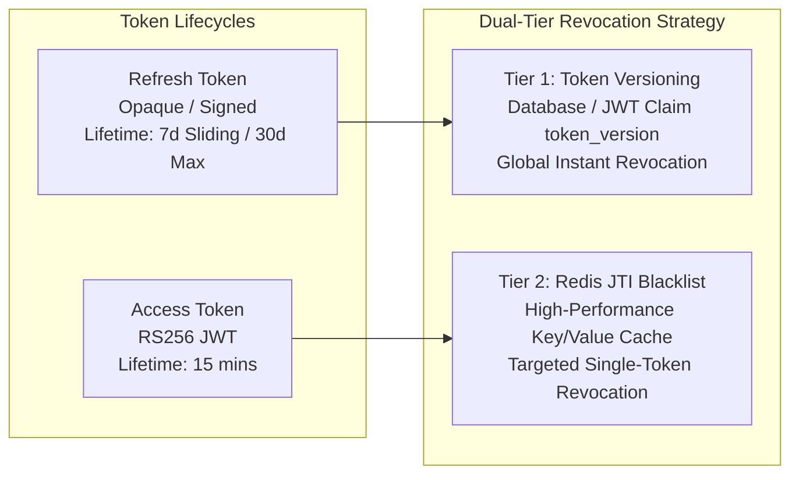

# ADR-0004: Identity Token Lifecycles, Rotation, Revocation, and Session Management

- **Status:** Accepted
- **Date:** 2026-07-25
- **Authors:** Principal Security Architect & Staff Software Engineer
- **Domain:** Identity & Access Management (IAM)

---

## Context

In a stateless modular monolith microservice architecture, JSON Web Tokens (JWTs) carry identity context and authorizations across API request lifecycles. However, statelessness introduces a fundamental challenge: once an access token is issued, it cannot be revoked without introducing server-side state lookup.

To maintain an uncompromising security posture across multi-tenant web and mobile clients, the Kinergy Platform requires a defined token strategy covering token lifetimes, token rotation, instant revocation mechanisms, and active multi-device session tracking.

---

## Problem

1. **Long-Lived Token Risks:** Long-lived access tokens expose a wide window of vulnerability if intercepted.
2. **Revocation Latency:** Stateless access tokens are valid until expiration even if an administrator suspends the user or the user logs out.
3. **Multi-Device Sprawl:** Users logging in across desktop browsers, mobile apps, and IoT operations portals need the ability to view and terminate specific sessions independently.

---

## Decision

We decide to implement a **Hybrid Token Lifecycle Model** combining **Short-Lived Access Tokens**, **Rotating Refresh Tokens**, **Global Token Versioning**, and **High-Performance Redis JTI Blacklisting**.

### 1. Token Lifetimes & Structure

- **Access Token:**
  - **Lifetime:** 15 minutes (non-configurable default for standard sessions).
  - **Format:** Asymmetrically signed JWT (RS256/Ed25519).
  - **Claims:** `sub`, `tenant_id`, `roles`, `permissions`, `token_version`, `jti`, `exp`, `iat`.

- **Refresh Token:**
  - **Lifetime:** 7 days sliding expiration (renewed on use); 30 days absolute maximum lifetime from initial issuance.
  - **Format:** Cryptographically secure 256-bit random opaque string associated with a `session_id` and `family_id` in database.

### 2. Refresh Token Rotation (RTR) Mechanics

- Every `/auth/refresh` invocation requires presenting the current valid refresh token.
- The server validates the token, invalidates it immediately, and issues a fresh Access Token + Refresh Token pair.
- **Reuse Security Trigger:** If an invalidated (previously consumed) refresh token is submitted:
  - The security system flags a potential theft/replay attack.
  - The entire **Token Family** associated with that session is revoked instantly.
  - All active tokens for that session are invalidated, forcing re-authentication.

### 3. Dual-Tier Revocation Strategy

To achieve real-time session termination without sacrificing the benefits of stateless JWT verification, we employ a two-tiered revocation model:

#### Tier 1: Global Account & Session Invalidation via Token Versioning (`token_version`)

- Every `Account` entity maintains an integer `token_version` in the database.
- The `token_version` is embedded in Access Token claims during minting.
- When critical security events occur (password reset, account suspension, "Sign Out of All Devices"), the account's `token_version` is incremented in PostgreSQL.
- NestJS Auth Guard compares `token_version` from JWT claims against the user context (cached in memory for 60 seconds), rejecting tokens with outdated versions instantly.

#### Tier 2: Targeted Token Revocation via Redis JTI Blacklisting

- For immediate single-token sign-outs or admin revocation before token expiration:
  - The token's unique ID (`jti`) is written to a Redis Key-Value store with a Time-To-Live (TTL) matching the token's remaining lifespan (`exp - currentTime`).
  - Auth Guard checks Redis for JTI presence only when explicit revocation is flagged.

### 4. Multi-Device & Session Context Management

- Each Refresh Token is mapped to a `UserSession` domain entity tracking:
  - `id`: Unique session UUID.
  - `deviceId`: Unique client hardware/browser fingerprint.
  - `userAgent`: Formatted client browser/OS identity string.
  - `ipAddress`: Originating client IP address.
  - `lastActiveAt`: Timestamp of last token refresh.
- Users can query active sessions and execute targeted terminations (e.g. "Revoke iPhone session").

---

## Alternatives Considered

1. **Pure Stateless JWTs without Revocation:**
   - _Pros:_ Zero database or cache lookup required on any request.
   - _Cons:_ Unacceptable security risk—stolen tokens remain valid until expiration; logout cannot be enforced server-side.
2. **Database Lookup on Every API Request:**
   - _Pros:_ Simple to reason about session validity.
   - _Cons:_ Defeats the architectural benefits of stateless APIs, creating a massive bottleneck on the primary database under load.

---

## Consequences

### Positive

- **Instant Revocation Control:** Ability to revoke single tokens (Redis JTI) or all tokens across devices (`token_version`) immediately.
- **Automatic Attack Response:** RTR family reuse detection prevents stolen refresh tokens from being exploited silently.
- **Device Transparency:** Complete user visibility over active multi-device sessions.

### Negative

- **Infrastructure Dependency:** Requires Redis cluster for real-time JTI blacklisting.
- **Clock Synchronization:** Distributed API nodes must run NTP to avoid clock skew errors when evaluating JWT `exp` claims.

---

## Future Evolution

1. **Shortened Access Token Lifetimes for Sensitive Routes:** Step-up token generation (e.g., 2-minute lifetime) for sensitive administrative operations.
2. **Push Revocation Events:** Broadcasting token revocation notifications over WebSockets/SSE to disconnect active client sessions in real-time.
