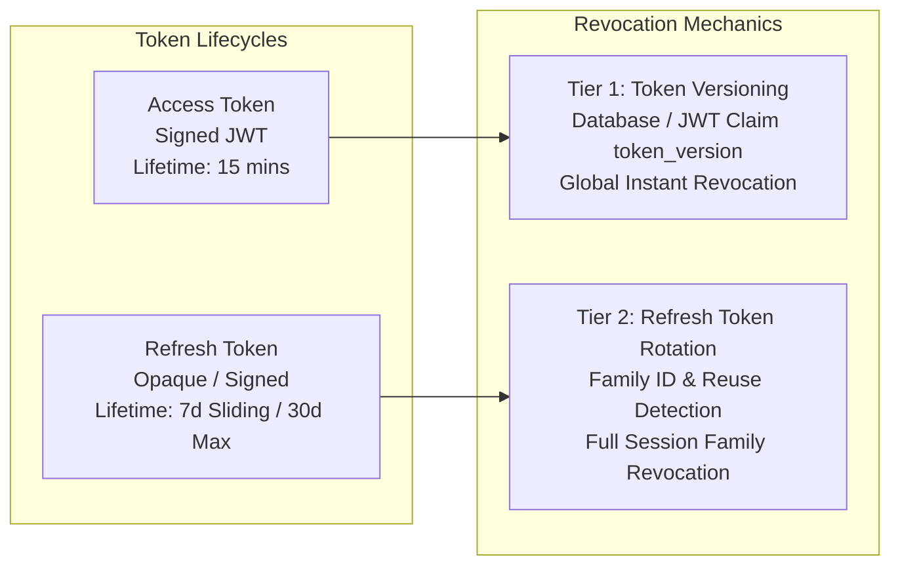

# Identity Token Lifecycles, Rotation, Revocation, and Session Strategy

- **Status:** Accepted (Authoritative Specification)
- **Date:** 2026-07-29
- **Authors:** Principal Security Architect & Staff Software Engineer
- **Domain:** Identity & Access Management (IAM)
- **ADR Alignment:** [ADR 0018](file:///c:/Projects/kinergy-platform/docs/adr/0018-jwt-token-infrastructure.md), [ADR 0019](file:///c:/Projects/kinergy-platform/docs/adr/0019-refresh-token-persistence-strategy.md), & [ADR 0022](file:///c:/Projects/kinergy-platform/docs/adr/0022-token-configuration-policy-abstraction.md)

---

## 1. Executive Summary

JSON Web Tokens (JWTs) carry identity context and authorization claims across API request lifecycles. To maintain an uncompromising security posture across multi-tenant web and mobile clients, the Kinergy Platform implements a **Dual-Token Architecture** with **Refresh Token Rotation (RTR)**, **Token Family Reuse Detection**, and **Token Version Invalidation**.

---

## 2. Token Configuration & Policy Abstraction

Token parameters are managed by `ConfigTokenConfiguration` (`ITokenConfiguration`) and validated during application bootstrap:

| Config Option          | Property                 | Default Setting                       | Description                               |
| :--------------------- | :----------------------- | :------------------------------------ | :---------------------------------------- |
| **Access Secret**      | `accessTokenSecret`      | `JWT_ACCESS_SECRET` ($\ge 32$ chars)  | Key for signing short-lived Access Tokens |
| **Access Expiration**  | `accessTokenExpiration`  | `15m` ($15\text{ minutes}$)           | Access Token expiration window            |
| **Refresh Secret**     | `refreshTokenSecret`     | `JWT_REFRESH_SECRET` ($\ge 32$ chars) | Key for signing Refresh Tokens            |
| **Refresh Expiration** | `refreshTokenExpiration` | `7d` ($7\text{ days}$)                | Sliding window Refresh Token duration     |
| **Issuer**             | `issuer`                 | `kinergy-platform`                    | Standard `iss` claim                      |
| **Audience**           | `audience`               | `kinergy-api`                         | Standard `aud` claim                      |

---

## 3. Refresh Token Rotation (RTR) & Reuse Detection

1. **Sliding Window Renewal**: Every `/auth/refresh` invocation presents the current Refresh Token, invalidates it immediately, and issues a new Access Token + Refresh Token pair.
2. **Family Tracking (`familyId`)**: Tokens belong to an immutable `familyId`.
3. **Replay Attack Trigger**: If an already consumed (old) refresh token is submitted, `RefreshTokenUseCase` detects a replay attack, invalidates all tokens under `familyId`, emits `RefreshTokenReplayDetected` (CRITICAL alert), and returns `HTTP 401 Unauthorized`.

---

## 4. Token Version Invalidation (`tokenVersion`)

- Every `User` aggregate contains an integer `tokenVersion`.
- Embedded in JWT access token claims (`tokenVersion`).
- When critical security events occur (password change, reset, forced logout), `tokenVersion` is incremented.
- `AuthenticationGuard` checks `tokenVersion` from JWT claims against active context, rejecting stale tokens instantly.
