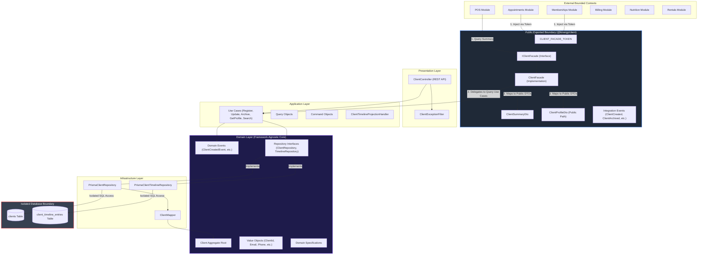

# Client Subsystem — Architecture & Integration Diagrams

## Overview

The Client bounded context (`modules/client/`) is built following strict **Hexagonal Architecture (Ports and Adapters)** and **Domain-Driven Design (DDD)** principles.

All cross-module synchronous access is mediated through a single public entry point (`ClientFacade`), and all asynchronous cross-module notifications are handled via versioned **Integration Events**.

---

## 1. Module Architecture & Boundary Layering

The diagram below illustrates the internal Hexagonal Architecture layering (Presentation ➔ Application ➔ Domain  Infrastructure) alongside the public exported boundary (`@kinergy/client`).

---

## 2. Synchronous Integration Sequence Diagram

This diagram illustrates an external module (`AppointmentsModule`) executing a synchronous check to verify if a client is active prior to booking an appointment. Notice how `ClientFacade` intercepts internal domain exceptions (e.g. `ClientNotFoundException`) and returns `false` or `null` without leaking private exception types across module boundaries.

```mermaid
sequenceDiagram
    autonumber
    actor User as Client / Staff User
    participant AppService as AppointmentsService (External Module)
    participant Facade as ClientFacade (IClientFacade)
    participant UseCase as GetClientProfileUseCase
    participant Repo as PrismaClientRepository
    participant DB as PostgreSQL Database

    User->>AppService: Book Appointment Request (clientId)
    AppService->>Facade: isClientActive(clientId)

    rect rgb(30, 41, 59)
        note right of Facade: Internal Module Delegation & Exception Shielding
        Facade->>UseCase: execute(GetClientProfileQuery)
        UseCase->>Repo: findById(ClientId.create(clientId))
        Repo->>DB: SELECT * FROM clients WHERE id = $1

        alt Client Found & Active
            DB-->>Repo: Client Record (status = "ACTIVE")
            Repo-->>UseCase: Client Aggregate Root
            UseCase-->>Facade: ClientProfileDto (status = "ACTIVE")
            Facade-->>AppService: true
            AppService-->>User: Proceed with Booking
        else Client Found but Archived
            DB-->>Repo: Client Record (status = "ARCHIVED")
            Repo-->>UseCase: Client Aggregate Root
            UseCase-->>Facade: ClientProfileDto (status = "ARCHIVED")
            Facade-->>AppService: false
            AppService-->>User: Reject Booking (Client Archived)
        else Client Not Found in Database
            DB-->>Repo: null
            Repo-->>UseCase: null
            UseCase-->>Facade: throws ClientNotFoundException
            note over Facade: Catch ClientNotFoundException<br/>Translate to null / false fallback
            Facade-->>AppService: false
            AppService-->>User: Reject Booking (Client Does Not Exist)
        end
    end
```

---

## 3. Asynchronous Integration Sequence Diagram

This diagram illustrates how an external bounded context (e.g., `Appointments`) publishes an integration event (`AppointmentScheduledIntegrationEvent`) when an appointment is booked, and how the Client subsystem asynchronously consumes it to update the Client Activity Feed read model (`client_timeline_entries`).

```mermaid
sequenceDiagram
    autonumber
    participant AppDomain as Appointments Context
    participant EventBus as Event Bus / Message Broker
    participant TimelineHandler as ClientTimelineProjectionHandler
    participant TimelineRepo as PrismaClientTimelineRepository
    participant DB as PostgreSQL (client_timeline_entries)

    Note over AppDomain, EventBus: Asynchronous Cross-Module Activity Feed Projection

    AppDomain->>EventBus: Publish AppointmentScheduledIntegrationEvent
    note right of AppDomain: payload: { appointmentId, clientId, serviceName, providerName, scheduledFor }

    EventBus->>TimelineHandler: Deliver Integration Event

    rect rgb(30, 41, 59)
        note right of TimelineHandler: Asynchronous Projection Execution
        TimelineHandler->>TimelineHandler: Build ClientTimelineEntry Read Model
        note right of TimelineHandler: eventType: "APPOINTMENT_SCHEDULED"<br/>summary: "Scheduled haircut with Alex"<br/>occurredAt: event.occurredAt

        TimelineHandler->>TimelineRepo: save(timelineEntry)
        TimelineRepo->>DB: INSERT INTO client_timeline_entries (...)

        alt Persistence Success
            DB-->>TimelineRepo: OK
            TimelineRepo-->>TimelineHandler: OK
        else Persistence Error (Non-Blocking)
            DB-->>TimelineRepo: Database Error / Constraint Failure
            TimelineRepo-->>TimelineHandler: Throws Error
            note over TimelineHandler: Catch & Log Error<br/>Prevent write-model transaction rollback
        end
    end
```

