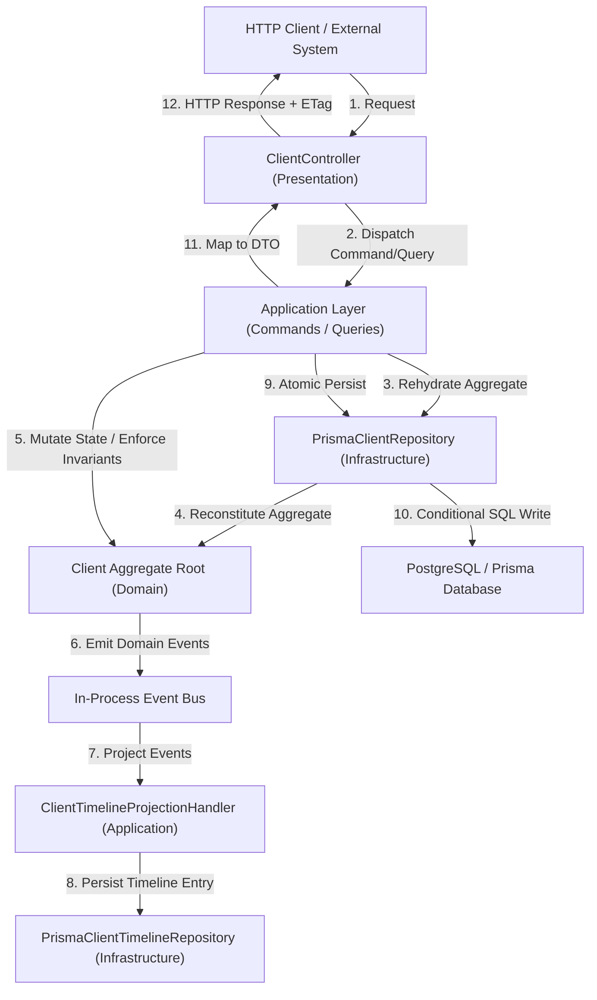

# Phase 2 Progress Report: Client Domain & Subsystem Implementation

This document provides a comprehensive overview of the architectural decisions, business invariants, application use cases, persistence strategy, and API endpoints delivered across **Milestones 2.1 to 2.7** within `modules/client/`.

---

## Architecture & Layer Request Flow

---

## Milestone Summary (2.1 – 2.7)

### Milestone 2.1 — Client Domain Foundation

- **Aggregate Root:** `Client` Aggregate Root inside `modules/client/domain/aggregates/client.aggregate.ts`.
- **Value Objects:** Pure immutable Value Objects: `ClientId`, `ClientName`, `EmailAddress` (strict RFC 5322 regex format), `E164PhoneNumber` (`+\d{8,15}` normalization), `ClientReferenceNumber` (`CLI-YYYY-XXXXX`), and `NormalizedSearchName` (diacritic stripping & NFD normalization).
- **Domain Events:** `ClientCreatedEvent`, `IdentityLinkedEvent`, `ClientArchivedEvent`, and `ClientRestoredEvent`.
- **Specifications:** `CanRegisterClientSpecification`, `CanArchiveClientSpecification`, and `ClientAlreadyLinkedSpecification`.

### Milestone 2.2 — Client Registration

- **Duplicate Prevention:** `ClientDuplicateCheckerService` implementing hard duplicate checks (unique `email` or `phone`) and soft duplicate similarity detection.
- **Persistence:** `PrismaClientRepository` bi-directionally mapped via `ClientMapper`.
- **REST Endpoints:** `POST /clients` (returns `201 Created` or `409 Conflict` with potential matches) and `POST /clients/:id/link-identity`.

### Milestone 2.3 — Client Profile

- **Authoritative Representation:** `ClientProfileDto` encapsulating complete business attributes with explicit `referenceNumber` visibility.
- **Selective Identity Visibility:** Linked `identityId` exposed only when the requesting context is authorized (administrative/staff role or self client).
- **REST Endpoint:** `GET /clients/:id` with `ClientNotFoundException` mapping cleanly to HTTP `404 Not Found`.

### Milestone 2.4 — Client Search

- **Database Optimization:** Raw SQL migration enabling PostgreSQL `pg_trgm` extension and GIN trigram indexes on `normalized_search_name`, `email`, and `phone`.
- **Generic Pagination:** Reusable `PaginatedResultDto<T>` calculating `totalPages`, `hasNextPage`, and `hasPreviousPage`.
- **Application Query:** `SearchClientsUseCase` sanitizing text search and enforcing page & limit safety bounds (default limit 10, max limit 100).
- **REST Endpoint:** `GET /clients` with `SearchClientsQueryDto` query parameter validation.

### Milestone 2.5 — Client Update

- **Partial PATCH Updates:** `updateDetails` mutating only supplied fields (`name`, `email`, `phone`) and recalculating `normalizedSearchName`.
- **Archived Modification Guard:** Throwing `ArchivedClientCannotBeModifiedException` (HTTP `422 Unprocessable Entity`) if attempting to modify archived clients.
- **Optimistic Concurrency Control:** HTTP `If-Match` header and body version validation, atomic `UPDATE ... WHERE id = :id AND version = :expectedVersion` query execution, and throwing `OptimisticLockException` (HTTP `412 Precondition Failed`) on version mismatch. Response sets `ETag: "{version}"`.
- **REST Endpoint:** `PATCH /clients/:id`.

### Milestone 2.6 — Archive & Restore

- **No Physical Deletion:** Lifecycle management via `ClientStatus` state machine (`ACTIVE` ↔ `ARCHIVED`). Records are never removed from the database.
- **State Guard Invariants:** `ClientAlreadyArchivedException` (HTTP `409 Conflict`) for double-archive attempts; `ClientAlreadyActiveException` (HTTP `409 Conflict`) for double-restore attempts.
- **Domain Events:** `ClientArchivedEvent` and `ClientRestoredEvent` emitted on successful state transitions.
- **RBAC Authorization:** Only `ADMIN` or `STAFF` roles may archive or restore clients (HTTP `403 Forbidden` otherwise).
- **REST Endpoints:** `PATCH /clients/:id/archive` and `PATCH /clients/:id/restore` (both return `200 OK` with updated `ClientProfileDto` and `ETag` header).

### Milestone 2.7 — Client Activity Feed

- **Decoupled Read Model:** `ClientTimelineEntry` read model entity persisted in the `client_timeline_entries` table — completely independent of the `Client` write-model aggregate.
- **Event Projection:** `ClientTimelineProjectionHandler` subscribes to all client domain events (`ClientCreatedEvent`, `ClientUpdatedEvent`, `IdentityLinkedEvent`, `ClientArchivedEvent`, `ClientRestoredEvent`) and asynchronously projects each into a timeline row. Projection errors are caught and logged to prevent write-model transaction failures.
- **New Domain Event:** `ClientUpdatedEvent` emitted by `Client.updateDetails()` carrying the list of mutated fields.
- **Pagination:** `ClientTimelineRepository.findByClientId(clientId, page, limit)` returns `PaginatedResultDto<ClientTimelineEntry>` ordered by `occurred_at DESC`.
- **Application Layer:** `GetClientHistoryUseCase` verifies client existence before querying timeline, then maps entries to `ClientTimelineEntryDto`.
- **REST Endpoint:** `GET /clients/:id/history?page=1&limit=20` — requires authentication, returns `200 OK` with `PaginatedResultDto<ClientTimelineEntryDto>`, `404 Not Found` if client does not exist.
- **Database:** New Prisma `ClientTimelineEntry` model and migration `20260730000001_add_client_timeline_entries` adding the `client_timeline_entries` table with cascade-delete FK, and indexes on `client_id`, `event_type`, and `occurred_at`.

---

## Verification & Quality Assurance

- **101 client-domain test suites passing** (unit, integration, E2E, and performance) across 19 test files.
- **238 API tests passing** (55 test suites in `apps/api`).
- **Zero-Regression Standard:** Verified through full `pnpm validate` suite on every milestone (formatting, linting across 9 projects, `tsc --noEmit` typechecking, all tests, and project builds).

---

## Key Files Reference

| Area                          | File                                                                                    |
| ----------------------------- | --------------------------------------------------------------------------------------- |
| Aggregate Root                | `modules/client/domain/aggregates/client.aggregate.ts`                                  |
| Timeline Read Model           | `modules/client/domain/read-models/client-timeline-entry.entity.ts`                     |
| Timeline Repository Interface | `modules/client/domain/repositories/client-timeline.repository.ts`                      |
| Projection Handler            | `modules/client/application/events/client-timeline-projection.handler.ts`               |
| History Use Case              | `modules/client/application/use-cases/get-client-history.usecase.ts`                    |
| Prisma Timeline Repository    | `modules/client/infrastructure/persistence/prisma/prisma-client-timeline.repository.ts` |
| REST Controller               | `modules/client/presentation/controllers/client.controller.ts`                          |
| Prisma Schema                 | `prisma/schema.prisma`                                                                  |
| Timeline Migration            | `prisma/migrations/20260730000001_add_client_timeline_entries/migration.sql`            |
